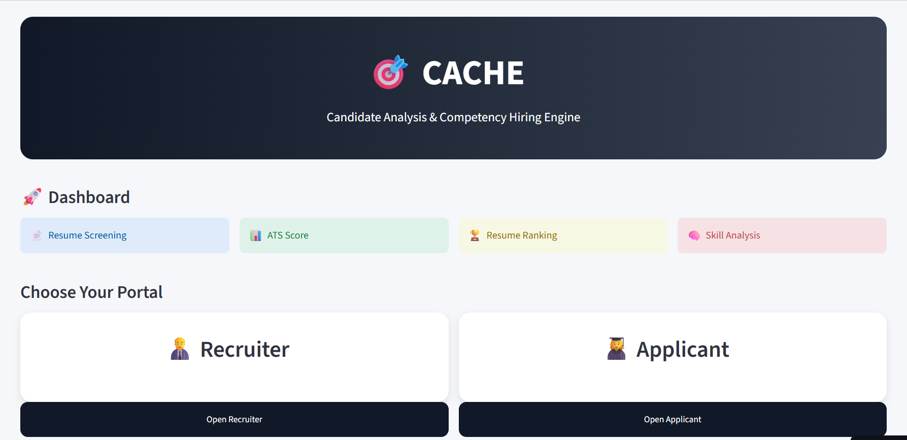
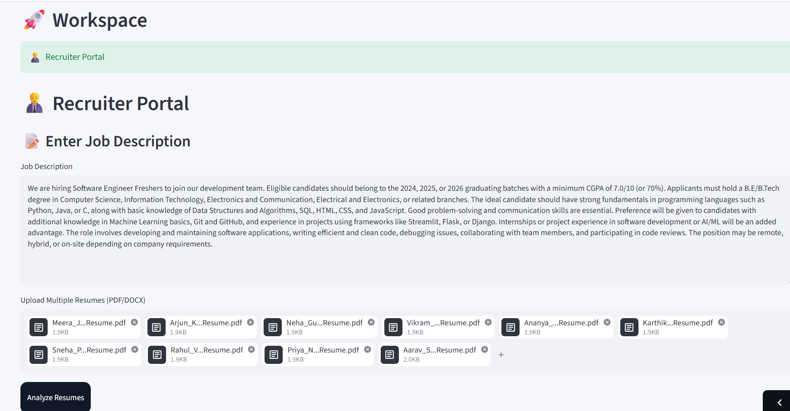
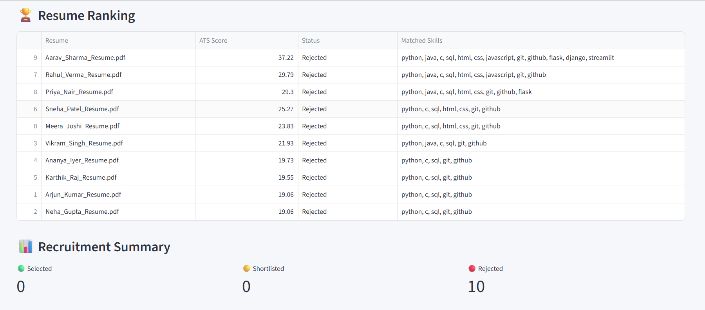
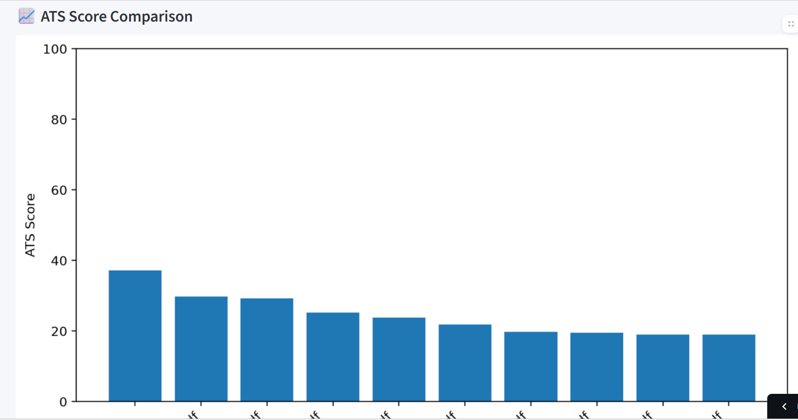
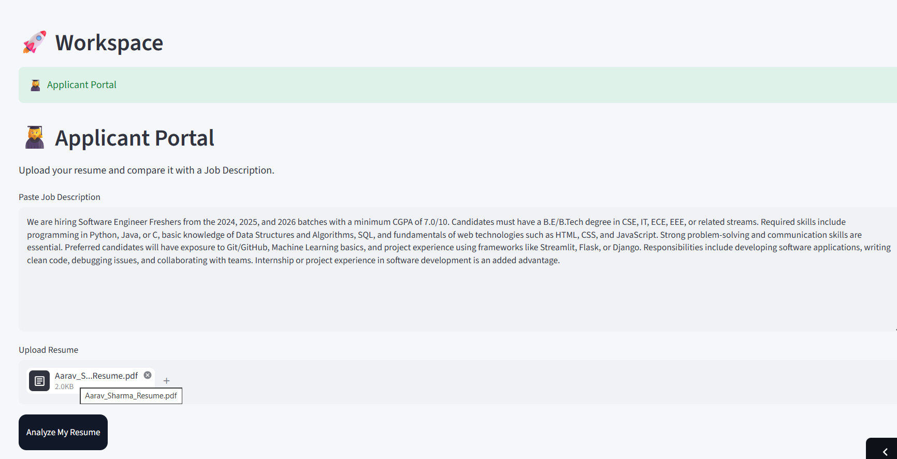
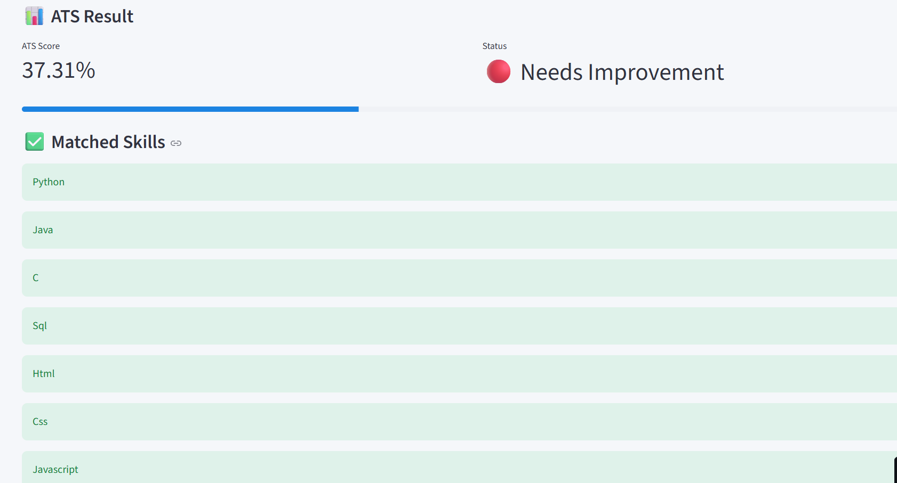

# CACHE – Candidate Analysis & Competency Hiring Engine

An AI-powered **Applicant Tracking System (ATS)** developed using **Python** and **Streamlit**. CACHE helps recruiters efficiently screen and rank resumes while providing applicants with ATS scores, skill analysis, and personalized resume improvement suggestions.

## Live Demo

**🔗 Application:** https://cache-ats.streamlit.app

## GitHub Repository

**🔗 Repository:** https://github.com/kmuthupavithira/CACHE-ATS

# Project Overview

CACHE (Candidate Analysis & Competency Hiring Engine) is designed to simplify the recruitment process by automatically evaluating resumes against a job description using Natural Language Processing (NLP).

The system calculates ATS compatibility scores using **TF-IDF Vectorization** and **Cosine Similarity**, identifies matched and missing skills, ranks candidates, and generates recruiter-friendly analytics.

Applicants can also upload their resumes to receive instant feedback and recommendations to improve their ATS score.

# Features

## Recruiter Portal

* Upload multiple resumes
* Enter a Job Description
* Automatic ATS Score calculation
* Resume ranking
* Skill matching analysis
* Candidate categorization

  * ✅ Selected
  * 🟡 Shortlisted
  * ❌ Rejected
* Interactive charts and analytics
* Download ATS report as CSV

## Applicant Portal

* Upload resume
* ATS compatibility score
* Matched skills
* Missing skills detection
* Resume improvement suggestions
* Visual score analysis

# Technologies Used

* Python
* Streamlit
* Scikit-learn
* Pandas
* Matplotlib
* PyPDF2
* pdf2image
* pytesseract
* Pillow

# AI Techniques

* TF-IDF Vectorization
* Cosine Similarity
* Keyword Matching
* OCR-based Text Extraction
* Resume Ranking Algorithm

# 📸 Project Screenshots

## Home Page

---

## Recruiter Portal

---

## Resume Ranking

---

## Analytics Dashboard

---

## Applicant Portal

---

## ATS Analysis

# Project Structure
CACHE-ATS
│
├── images/
│   ├── home.png
│   ├── recruiter.png
│   ├── recruiter-results.png
│   ├── recruiter-charts.png
│   ├── applicant.png
│   └── ats-score.png
│
├── app.py
├── recruiter.py
├── applicant.py
├── auth.py
├── utils.py
├── requirements.txt
├── README.md
└── .gitignore

# Future Enhancements

* AI-powered resume recommendations
* LLM-based resume feedback
* Interview question generation
* Recruiter login authentication
* Cloud database integration
* Email notifications
* PDF report generation

# Developer

**Muthu Pavithira**

Electronics and Communication Engineering

KLN College of Engineering

# Support

If you found this project useful, please consider giving this repository a **⭐ Star** on GitHub.

Your support is greatly appreciated!
